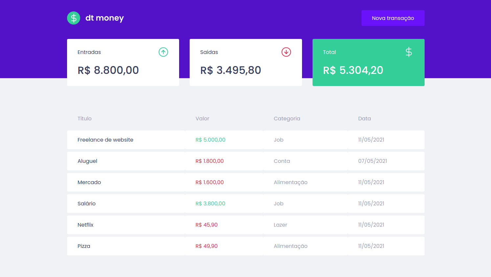
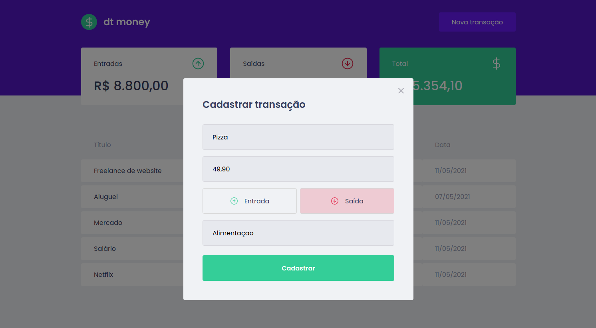

<h1>dt money</h1>

## 🚀 Como executar

- Clone o repositório
- Instale as dependências com `yarn`
- Inicie o servidor com `yarn start`

A aplicação pode ser acessada em [`localhost:3000`](http://localhost:3000).

## 📺 Páginas

  <h3>Home</h3>
  
   
  <h3>Nova Transação</h3>
  

## 📄 Licença

Esse projeto está sob a licença MIT. Veja o arquivo [LICENSE](LICENSE) para mais detalhes.

---